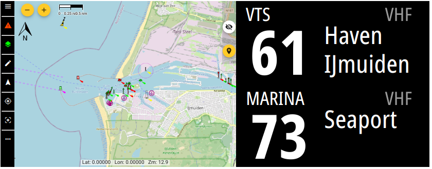

# VHFinfo
VHF channel information based on GeoJSON data. Plugin for SignalK included.

## Purpose
While sailing you're often expected to listen out certain VHF channels. Most of them can be found on the electronic maps, but not always in a handy way. And it requires you to know you have to look for it in advance.

By collection the VHF channel info together with coordinate information it's easy to display relevant information in the cockpit.



## Format used
The information is collected as [GeoJSON](https://geojson.org/) which holds both coordinates and properties.

## Viewing information
see if certain VHF information is already present, you can look at the [online map](https://htool.github.io/vhfinfo/public/index.html)

## Adding information
To add information you open the [online map](https://htool.github.io/vhfinfo/public/index.html) and locate the area you want to edit.
Press the pencil icon in the top left corner to go to the edit page for that country.

### Drawing the coordinates on the map
Goto one of the following country linke and draw the VHF channel area as a polygon.
For different types there are different instructions for drawing:

#### Lock
Only draw the full locks chambers (typically rectangles). It's OK to cross over land for multiple chambers
#### Bridge
Only draw under the bridge, fully from side to side (typically rectangles)
#### Marina
Free figure polygon that covers only the (land and water if that's simpler) marina
#### VTS
Here it is important to cover the documented coordinates of the VTS as close as possible, so likely a polygon. In case of half circles on sea towards a port, it's ok to make it less detailed to reduce points)


### Properties template
```
      "properties": {
        "name": "",           // Full name
        "callname": "",       // Short name typically used in call
        "type": "",           // ['lock','bridge','marina','vts','territorial']
        "channel": ,          // VHF channel number
        "update": "5 *",      // Update bulletin (eg weather) in this VHF area in 'cron format'
        "vhfdata": {
          "generic": {
            "mode": "listen"  // Radio engagement level for this AIS ship/group type
                              // 'listen':    Listen out the channel for any calls or information
                              // 'announce':  Announce you are entering/leaving the area, or intend to pass bridge/lock
                              // 'report':    More than announce, as certain info is expected. See 'note' for details
            "url": "",        // URL with generic info like opening hours, approach guide etc. or in case of non-generic purpose
            "phone": ""       // Phone number in E.164 formatting
          }
          "pleasure": {       // AIS ship/group type as string. (https://coast.noaa.gov/data/marinecadastre/ais/VesselTypeCodes2018.pdf)
            "url":  ""        // URL aimed at pleasure ships
          },
          "passenger": {
            "note": ""        // Note aimed at passenger ships
          },
          "fishing": {
            "mode": "announce"  // Overwrites mode for fishing ships
          },
          "cargo": {
            "mode": "report",
            "note": "",         // Extra details on what to report
            "url":  ""          // URL aimed at cargo ships
          },
          "emergency": {
            "url":                  // Information for emergencies in this area
            "phone": ""             // Emergency phone number
          }
        }
      }
    }
```
## Plugins
Plugins can be create separate from this repository and just use VHFinfo as database. Listing them here could make them easier to find.

### SignalK
The plugin lets you configure the search 'beam' by specifying the length and angle as well as the SignalK path to write to.
The plugin flow is as follows:
 1. Determine own location using `navigation.position`
 2. Draw a boundry box around the location with 100Nm (configurable) ribs
 3. Use countries_bbox.json to create bboxes and check if they intersect with the locationBox from step 2
 4. Read features from intersecting to see which intersect with locationBox from 2 and keep them in memory (featuresInBox)
 5. Use heading and location to crete a searchPolygon 'beam' using the plugin config parameters
 6. Go through the features in featuresInBox and check if they intersect with searchPolygon
 7. Use result of 6 to calculate distance to each feature and sort by distance (negative distance means your located inside the feature)
 8. /plugin/vhfinfo/nearby can be called to pull the whole result set of 7.
 9. Write the nearest POI and VTS to the path configured in the plugin

#### API
The resulting nearby VHF info objects array can be queried here:
```
/plugins/vhfinfo/nearby
```

#### SignalK path
You can configure where the plugin writes the two nearest Point of Interest (lock, bridge, marina) and VTS (Vessel Traffic Service). This can be used together with the [SignalK Instrument Display Plugin](https://www.npmjs.com/package/signalk-instrument-display-plugin) to display current VHF info on any display.
