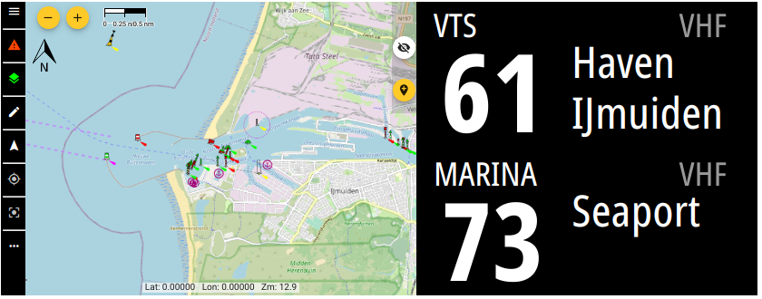

# VHFinfo
VHF channel information based on GeoJSON data. Plugin for SignalK included.

## Purpose
While sailing you're often expected to listen out certain VHF channels. Most of them can be found on the electronic maps, but not always in a handy way. And it requires you to know you have to look for it in advance.

By collection the VHF channel info together with coordinate information it's easy to display relevant information in the cockpit.



## Format used
The information is collected as [GeoJSON](https://geojson.org/) which holds both coordinates and properties.

## Repositories

- **[htool/vhfinfo](https://github.com/htool/vhfinfo)** (this repo): GeoJSON in `data/` and the SignalK plugin.
- **[htool/VHFinfoSite](https://github.com/htool/VHFinfoSite)**: [vhfinfo.org](https://vhfinfo.org) (map, Nearby, editor).

## Viewing information
See if certain VHF information is already present on the [online map](https://vhfinfo.org/).

## Adding information
Open the [online map](https://vhfinfo.org/map.html), find the area, and press the pencil. Changing the map requires signing in (email link, no password). Site source and sign-in setup live in [htool/VHFinfoSite](https://github.com/htool/VHFinfoSite).

Feature rows live in Supabase (`supabase/README.md`). The map reads that table, with this repo’s `data/{CC}.json` as fallback. Publishing writes the table; country files here are synced from it.

### Drawing the coordinates on the map
Goto one of the following country linke and draw the VHF channel area as a polygon.
For different types there are different instructions for drawing:

#### Lock
Only draw the full locks chambers (typically rectangles). It's OK to cross over land for multiple chambers
#### Bridge
Only draw under the bridge, fully from side to side (typically rectangles)
#### Marina
Free figure polygon that covers only the (land and water if that's simpler) marina
#### VTS / VTS Radar support
Here it is important to cover the documented coordinates of the VTS as close as possible, so likely a polygon. In case of half circles on sea towards a port, it's ok to make it less detailed to reduce points)


### Properties template
```
      "properties": {
        "name": "",           // Full name
        "callname": "",       // Short name typically used in call
        "type": "",           // Operational: Lock, Bridge, Marina, VTS, VTS Radar support, Area, Territorial. Information: information
        "channel": ,          // VHF channel number
        "update": "5 *",      // Update bulletin (eg weather) in this VHF area in 'cron format'
        "vhfdata": {
          "generic": {
            "mode": "listen"  // Radio engagement level for this AIS ship/group type
                              // 'listen':    Listen out the channel for any calls or information
                              // 'announce':  Announce you are entering/leaving the area, or intend to pass bridge/lock
                              // 'report':    More than announce, as certain info is expected. See 'note' for details
            "url": "",        // URL with generic info like opening hours, approach guide etc. or in case of non-generic purpose
            "phone": ""       // Phone number in E.164 formatting
          }
          "pleasure": {       // AIS ship/group type as string. (https://coast.noaa.gov/data/marinecadastre/ais/VesselTypeCodes2018.pdf)
            "url":  ""        // URL aimed at pleasure ships
          },
          "passenger": {
            "note": ""        // Note aimed at passenger ships
          },
          "fishing": {
            "mode": "announce"  // Overwrites mode for fishing ships
          },
          "cargo": {
            "mode": "report",
            "note": "",         // Extra details on what to report
            "url":  ""          // URL aimed at cargo ships
          },
          "emergency": {
            "url":                  // Information for emergencies in this area
            "phone": ""             // Emergency phone number
          }
        }
      }
    }
```
## Plugins
Plugins can be create separate from this repository and just use VHFinfo as database. Listing them here could make them easier to find.

### SignalK
The plugin lets you configure the search 'beam' by specifying the length and angle as well as the SignalK path to write to.
The plugin flow is as follows:
 1. Determine own location using `navigation.position`
 2. Draw a boundry box around the location with 100Nm (configurable) ribs
 3. Use countries_bbox.json to create bboxes and check if they intersect with the locationBox from step 2
 4. Read features from intersecting to see which intersect with locationBox from 2 and keep them in memory (featuresInBox)
 5. Use headingTrue, headingMagnetic, COG or bbox and location to create a searchPolygon 'beam' (or bbox) using the plugin config parameters
  6. Split features in memory into **operational** and **information**, filter and sort as in [Nearby ordering](#nearby-ordering).
  7. `/plugins/vhfinfo/nearby` (and `/signalk/v1/api/vhfinfo/nearby` on SK 2.x) returns that ordered list.
  8. Write the nearest of each type (including `vhfdata.nearest.information`) and the numbered list to the path configured in the plugin

#### Nearby ordering

The Nearby list (plugin, and the same rules on [vhfinfo.org/nearby](https://vhfinfo.org/nearby.html)) is two families concatenated: **operational first**, then **information**. A coast-radio station never ranks above a lock just because its transmitter is closer.

**Operational** — `vts`, `vts radar support`, `lock`, `bridge`, `marina`, `area`, `territorial`

1. Keep the feature only if its polygon **intersects the search beam** (heading / COG wedge). With no heading, or below the configured minimum speed, the beam is an omnidirectional box of the same length.
2. `distance` is **signed metres to the polygon boundary**: negative means the ship is inside (`INSIDE` in the UI).
3. Sort by **absolute** distance, nearest boundary first.

**Information** — GeoJSON type `information` (coast radio / remotes)

1. Ignore the beam. Keep the feature only if the ship is **inside** the coverage polygon.
2. `distance` is **positive metres to the polygon centroid** (the “transmitter” for a circle).
3. Sort by that distance, nearest centre first.

Metres in the API stay metres. The website may show values over 1852 m as nautical miles; that is display only and does not change the order.

##### Example A — beam ahead, lock and VTS

Heading east, 4 km / 90° beam. A marina astern does not intersect the beam, so it is omitted.

| Feature | In beam? | Boundary distance | Rank |
| --- | --- | --- | --- |
| VTS sector | yes | +800 m (ahead) | 1 |
| Lock | yes | +2100 m (ahead) | 2 |
| Marina (behind) | no | — | omitted |

##### Example B — already in the lock

Same beam. Inside the chamber the boundary distance is negative; sort still uses `|distance|`.

| Feature | Boundary distance | `\|d\|` | Rank |
| --- | --- | --- | --- |
| Lock (you are in it) | −12 m | 12 m | 1 |
| Marina off to starboard | +400 m | 400 m | 2 |

`INSIDE` is the sign of the distance, not a separate sort key.

##### Example C — overlapping coast radio

No heading involved. Two coverage circles overlap the ship; a third does not contain the ship.

| Feature | Ship inside? | Distance to centre | Rank |
| --- | --- | --- | --- |
| Coast radio A | yes | 3 km | 1 among information |
| Coast radio B | yes | 18 km | 2 among information |
| Coast radio C | no | — | omitted |

##### Example D — mixed list

Operational block, then information block:

1. Lock (−12 m)  
2. VTS (+800 m)  
3. Coast radio A (3 km to centre)  
4. Coast radio B (18 km to centre)

Coast radio A is closer than the VTS in a straight line, but it stays after every operational hit.

SignalK App Store installs come from the npm package [`vhfinfo`](https://www.npmjs.com/package/vhfinfo). A GitHub Action publishes a new patch version at most once per UTC day when country GeoJSON in `data/` or the SignalK plugin in `plugin/` has changed since the last release (see `.github/workflows/npm-publish-geojson.yml`). Publishing uses [npm trusted publishing](https://docs.npmjs.com/trusted-publishers/) (GitHub OIDC), so you do not need a rotating npm access token. Once, as package owner on npmjs.com: **Package → Settings → Trusted Publisher → GitHub Actions**, with organization `htool`, repository `vhfinfo`, workflow filename `npm-publish-geojson.yml`, and allowed action `npm publish`.

#### API
The resulting nearby VHF info objects array can be queried here:
```
/plugins/vhfinfo/nearby
```
On Signal K 2.x that path is admin-only. Readonly clients (MFD tiles with `allow_readonly`) use:
```
/signalk/v1/api/vhfinfo/nearby
/signalk/v1/api/vhfinfo/options
```

#### SignalK path
You can configure where the plugin writes the two nearest Point of Interest (lock, bridge, marina) and VTS (Vessel Traffic Service). This can be used together with the [SignalK Instrument Display Plugin](https://www.npmjs.com/package/signalk-instrument-display-plugin) to display current VHF info on any display.
